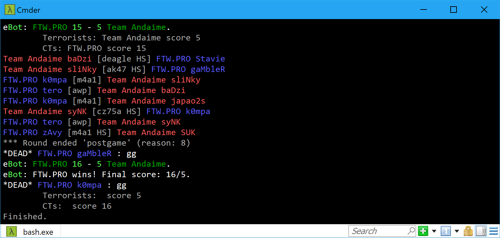

# demofile

 [](https://gitter.im/saul/demofile?utm_source=badge&utm_medium=badge&utm_campaign=pr-badge&utm_content=badge)

A node.js library for parsing Counter-Strike Global Offensive (CSGO) demo files.
The library is also Browserify-able, and a standalone bundle that you can `<script src="...">` is available in [browser/bundle.js](browser/bundle.js).

## Supported Demo Features

- Entity updates, server classes, data tables (including instance baselines)
- Both perspectives (GOTV and client-side recorded)
- User messages
- String tables
- Game events
- Console variables

## Documentation

Auto-generated API documentation is available at [saul.github.io/demofile](https://saul.github.io/demofile).

| Class                                                                   | Description                         |
| ----------------------------------------------------------------------- | ----------------------------------- |
| [DemoFile](https://saul.github.io/demofile/classes/_demo_demofile.html) | Represents a demo file for parsing. |

The _DemoFile_ object has properties which point to instances of several other classes that can be used to query the game world:

| Class                                                                                    | Property                | Description                                                                            |
| ---------------------------------------------------------------------------------------- | ----------------------- | -------------------------------------------------------------------------------------- |
| [ConVars](https://saul.github.io/demofile/classes/_convars_.convars.html)                | `demoFile.conVars`      | Manages console variables. (Only `FCVAR_NOTIFY` and `FCVAR_REPLICATED` are available.) |
| [Entities](https://saul.github.io/demofile/classes/_entities_.entities.html)             | `demoFile.entities`     | Represents entities and networked properties within a demo.                            |
| [GameEvents](https://saul.github.io/demofile/classes/_gameevents_.gameevents.html)       | `demoFile.gameEvents`   | Manages game events for a demo file. (e.g. `player_death`, `player_footstep`)          |
| [StringTables](https://saul.github.io/demofile/classes/_stringtables_.stringtables.html) | `demoFile.stringTables` | Handles string tables for a demo file. (e.g. `userinfo`)                               |
| [UserMessages](https://saul.github.io/demofile/classes/_usermessages_.usermessages.html) | `demoFile.userMessages` | Handles user messages for a demo file. (e.g. `SayText` for in-game chat messages)      |

There are several classes which allow access to different types of entities (e.g. players, items, props). These are summarised below:

| Entity                                                                                         | Usage                                                                     | Description                                                                                 |
| ---------------------------------------------------------------------------------------------- | ------------------------------------------------------------------------- | ------------------------------------------------------------------------------------------- |
| [Networkable](https://saul.github.io/demofile/classes/_entities_networkable_.networkable.html) | `demoFile.entities.getByHandle`<br>`demoFile.entities.entities[entIndex]` | Base class of all in-game entities, even non-renderable entities (e.g. `CCSTeam`).          |
| [BaseEntity](https://saul.github.io/demofile/classes/_entities_baseentity_.baseentity.html)    |                                                                           | Base class of most in-game entities (e.g. players, weapons, all other renderable entities). |
| [Player](https://saul.github.io/demofile/classes/_entities_player_.player.html)                | `demoFile.entities.players`<br>`demoFile.entities.getByUserId`            | Represents an in-game player.                                                               |
| [Weapon](https://saul.github.io/demofile/classes/_entities_weapon_.weapon.html)                | `demoFile.entities.weapons`<br>`player.weapon`<br>`player.weapons`        | Represents an in-game weapon (guns, grenades, knifes).                                      |

## Installation

### Browser

```html
<script src="browser/bundle.js"></script>
```

The `DemoFile` module will be available as `window.demofile`.

### Node

```bash
npm install --save demofile
```

## Screenshot



## API

This library provides full access to the data available in CSGO demo files. Unlike some other libraries, `demofile` is feature complete and supports the latest demos. As well as providing high-level APIs to access the state of the game, low-level access is available and is not discouraged.

Take a look at the `examples/dumpfile.js` file for an indication as to how the library can be used to introspect demo files. This example is by no means exhaustive -- see the 'docs' folder for documentation on all public classes and methods.

Note: It is important to note that events are fired at the end of a tick, after all entity props and string tables have been updated.

### Useful links

- [CS:GO Game Events - AlliedModders Wiki](https://wiki.alliedmods.net/Counter-Strike:_Global_Offensive_Events)
- [Gitter community](https://gitter.im/saul/demofile)

## Contributing

Please read the [Contributing Guidelines](./CONTRIBUTING.md) to learn how you can help out on the project.

## Examples

### Print player information when it changes

```ts
import fs = require("fs");
import demofile = require("demofile");

fs.readFile("test.dem", (err, buffer) => {
  const demoFile = new demofile.DemoFile();

  demoFile.stringTables.on("update", e => {
    if (e.table.name === "userinfo" && e.userData != null) {
      console.log("\nPlayer info updated:");
      console.log(e.entryIndex, e.userData);
    }
  });

  demoFile.parse(buffer);
});

/* Outputs:

Player info updated:
12 { unknown_lo: 4294967295,
  unknown_hi: 4294963202,
  xuid_lo: 17825793,
  xuid_hi: 3417033,
  name: 'HS',
  userId: 20,
  guid: 'STEAM_1:1:1708516',
  friendsId: 3417033,
  friendsName: '',
  fakePlayer: false,
  isHltv: false,
  customFiles: [ 0, 0, 0, 0 ],
  xuid: Long { low: 3417033, high: 17825793, unsigned: false } }

[repeated for other players]
*/
```

### Print kills

```ts
import fs = require("fs");
import demofile = require("demofile");

fs.readFile("test.dem", (err, buffer) => {
  const demoFile = new demofile.DemoFile();

  demoFile.gameEvents.on("player_death", e => {
    const victim = demoFile.entities.getByUserId(e.userid);
    const victimName = victim ? victim.name : "unnamed";

    // Attacker may have disconnected so be aware.
    // e.g. attacker could have thrown a grenade, disconnected, then that grenade
    // killed another player.
    const attacker = demoFile.entities.getByUserId(e.attacker);
    const attackerName = attacker ? attacker.name : "unnamed";

    const headshotText = e.headshot ? " HS" : "";

    console.log(`${attackerName} [${e.weapon}${headshotText}] ${victimName}`);
  });

  demoFile.parse(buffer);
});

/* Outputs:

HS [cz75a HS] flusha
Lekr0 [ak47 HS] friberg
KRIMZ [ak47] HS
JW [mac10 HS] Mixwell
JW [hegrenade] HS
JW [mac10 HS] Magisk

*/
```

### Print round changes

```ts
import fs = require("fs");
import demofile = require("demofile");

fs.readFile("test.dem", (err, buffer) => {
  const demoFile = new demofile.DemoFile();

  demoFile.gameEvents.on("round_end", e => {
    console.log(
      "*** Round ended '%s' (reason: %s, time: %d seconds)",
      demoFile.gameRules.phase,
      e.reason,
      demoFile.currentTime
    );

    // We can't print the team scores here as they haven't been updated yet.
    // See round_officially_ended below.
  });

  demoFile.gameEvents.on("round_officially_ended", e => {
    const teams = demoFile.teams;

    const terrorists = teams[2];
    const cts = teams[3];

    console.log(
      "\tTerrorists: %s score %d\n\tCTs: %s score %d",
      terrorists.clanName,
      terrorists.score,
      cts.clanName,
      cts.score
    );
  });

  demoFile.parse(buffer);
});

/* Outputs:

*** Round ended 'first' (reason: 7, time: 74.3828125 seconds)
        Terrorists: fnatic score 0
        CTs: OpTic Gaming score 1
*** Round ended 'first' (reason: 8, time: 134.203125 seconds)
        Terrorists: fnatic score 0
        CTs: OpTic Gaming score 2
*** Round ended 'first' (reason: 9, time: 217.609375 seconds)
        Terrorists: fnatic score 1
        CTs: OpTic Gaming score 2

*/
```

### Print player joining/leaving

```ts
import fs = require("fs");
import demofile = require("demofile");

fs.readFile("test.dem", (err, buffer) => {
  const demoFile = new demofile.DemoFile();

  demoFile.entities.on("create", e => {
    // We're only interested in player entities being created.
    if (!(e.entity instanceof demofile.Player)) {
      return;
    }

    console.log(
      "[Time: %d] %s (%s) joined the game",
      demoFile.currentTime,
      e.entity.name,
      e.entity.steamId
    );
  });

  demoFile.entities.on("beforeremove", e => {
    if (!(e.entity instanceof demofile.Player)) {
      return;
    }

    console.log(
      "[Time: %d] %s left the game",
      demoFile.currentTime,
      e.entity.name
    );
  });

  demoFile.parse(buffer);
});

/* Outputs:

[Time: 51.3125] btx`akatro (STEAM_1:0:2143797827) joined the game
[Time: 60.78125] Nabeegh (STEAM_1:0:427524390) joined the game
[Time: 65.71875] TAURUS left the game
[Time: 76.65625] drragster (STEAM_1:0:2144425259) joined the game

*/
```

### Print demo information (e.g. tick rate)

```js
import fs = require("fs");
import demofile = require("demofile");

fs.readFile("test.dem", (err, buffer) => {
  const demoFile = new demofile.DemoFile();

  demoFile.on("start", () => {
    console.log("Demo header:", demoFile.header);
    console.log("Tick rate:", demoFile.tickRate);

    // Stop parsing - we're finished
    demoFile.cancel();
  });

  demoFile.parse(buffer);
});

/* Outputs:

Demo header: { magic: 'HL2DEMO',
  protocol: 4,
  networkProtocol: 13637,
  serverName: '--== CSGO.PGLARENA.RO # Competitive ==--',
  clientName: 'GOTV Demo',
  mapName: 'de_inferno',
  gameDirectory: 'csgo',
  playbackTime: 3001.1875,
  playbackTicks: 192076,
  playbackFrames: 95995,
  signonLength: 325854 }
Tick rate: 64

*/
```
